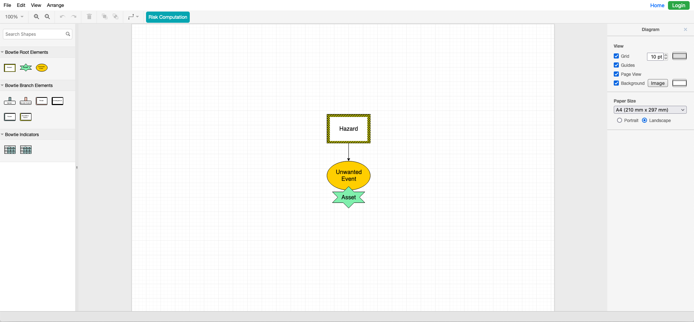

# BowtieTool

Bowtie++ is a **Web application** made for creating and editing bowtie risk analysis diagrams.



## Project file structure

```
/
 |-- app             # The application itself
 |-- website         # Website that presents Bowtie++ features
 |-- docs            # Documentation
 |-- screenshots     # Screenshots of the app
 `-- README.md
```

A **user manual** and a **technical documentation** can be found inside the `docs` directory.

## Installation

Please, refer to `docs/wiki.md`.
