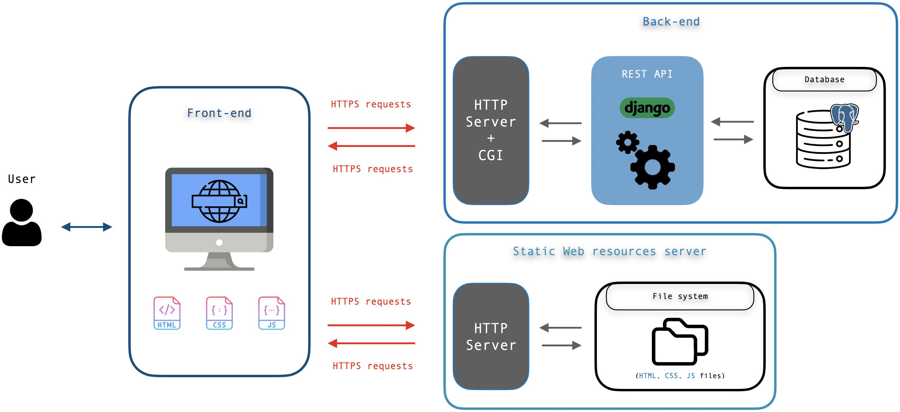

# Bowtie++ wiki

Bowtie++ is a **Web application** supporting security and safety risk analysis using bowtie diagrams.

- [Bowtie++ wiki](#bowtie++-wiki)
    - [Project's background](#projects-background)
    - [Requirements](#requirements)
    - [Installation](#installation)
    - [Deployment](#deployment)
    - [Installation on other types of processors](#installation-on-other-types-of-processors)
        - [Example for the raspberry PI (AMR32)](#example-for-the-raspberry-pi-ARM32)
    - [Technical documentation](#technical-documentation)
        - [Software architecture](#software-architecture)
        - [Front-end](#front-end)
        - [Back-end](#back-end)
    - [Licenses](#Licenses)
        - [Front-end](#front-end-2)
        - [Back-end](#back-end-1)

## Project's background

Bowtie++ is an evolution of Bowtie+ which was mainly based on [grapheditor](#Licenses). Grapheditor is an implementation example of a diagram editor made with the mxgraph library. You'll find the official GitHub repository of mxGraph in the Licenses part of this wiki.

## Requirements

- x86 64-bit architectured processor, more installation details for other processor types [here](#Installation-on-other-types-of-processors).
- Docker engine and docker compose : installation guide on the official website https://docs.docker.com/
- A recent browser that supports javascript modules (please refer to https://developer.mozilla.org/en-US/docs/Web/JavaScript/Guide/Modules for more information). **IE is not supported**.

**Windows users** may have to manually enable hardware virtualization in their BIOS settings to run docker containers.

## Installation

**branches**: `master` or `dev`.

<span style="color: #dc3545">WARNING:</span> only for development puposes, DO NOT use this configuration as a deployment model.

```bash
git clone https://github.com/bmoulkaf/BowtieTool
cd BowtieTool
```

**Configuring the backend .env file**

The Django REST API requires an environment file located at `backend/app/app/.env`. This file contains sentivive data, such as secret keys. **Be sure to make it accessible only to authorized persons**. An example of a typical `.env` file is given at `backend/app/app/.env.example`.

If you need more information about how to fill in this file, check the [technical documentation](#app-module).

**Configuring server ip addresses**

By default, both the frontend and backend are meant to run on your localhost. Here are the steps to run them on custom ip addresses.

Update the `.env` and set the ip adresses and ports on which your servers (frontend and backend) run:

```
STATIC_SERVER_HOST=localhost
STATIC_SERVER_PORT=8080
API_SERVER_HOST=localhost
API_SERVER_PORT=8000
```

Update the file `backend/app/app/settings.py` like this:

```python
# Add all of the servers form wich the requests will come
CORS_ORIGIN_WHITELIST = [
    'http://localhost:8080',
]
```

In `frontend/webapp/bowtie/js/env.js`, update the following variables to match the server ip on which the backend is installed and the port it listens to.

```javascript
const API_SERVER_HOST = 'localhost';
const API_SERVER_PORT = '8000';
```

You're now ready to launch the application.

**Launch Bowtie++**

You can either launch the whole app or just the frontend or backend part of Bowtie++. You can use the `start.sh` script to do that. At the root of the project:

```bash
./start.sh                # Launch the whole app
./start.sh frontend       # Launch the frontend
./start.sh backend        # Launch the backend
```

The script simply uses the `docker-compose up` command to launch the containers.

**Stop bowtie++**

You can stop the app with the `stop.sh` script. At the root of the project:

```bash
./stop.sh                # Stop the whole app launched with ./start.sh
./stop.sh frontend       # Stop the frontend launched with ./start.sh frontend
./stop.sh backend        # Stop the backend launched with ./start.backend
```

The script simply uses `docker container kill` to stop the containers.


## Deployment 

**branch**: `deploy`.

An example of deployment for Bowtie++ can be found on the branch `deploy` of this repository. This deployment uses 4 servers, each one encapsulated in a Docker container. Here is a picture of the deployment infrastructure: 


These 4 servers have been created to make the different components of the application independent. In a real deployment scenario, it's suggested to use the nginx reverse proxy server to deliver the static content from the front-end part ("static resources" in the picture) for better performance. It's also recommended to make the database run directly on a virtual machine other than a container in order to preserve the integrity of the data.

The reverse proxy communicates to the user using HTTPS protocol, and the other servers aren't directly connected to the external network. In order to establish a secure connection between all of the components of the application we suggest developing a separate public key infrastructure or using additional SSL/TLS certificates.

### Back-end (REST API)
**Gunicorn** is used as a CGI HTTP server. However Gunicorn can't serve the static content used by Django's admin panel. In order to serve the static files related to it, a volume shared by the reverse proxy container and the API server container has been created. The volume name is `static_volume` and can be found in the `docker-compos.yml` file. It's important  to add in the *nginx.conf* of the nginx-reverse proxy container the directory *staticfiles* as the location from where the server serves the HTML, CSS and JS files. In this directory are copied all the static files used by the django administration console when the containers are started from the docker-compose file. Without this volume and the configuration of the reverse proxy, the static files of the Django administration console could not be served to admin users.

### Environment file specifics

<span style="color: #dc3545">-- WARNING --</span>

The `.env` file **must** be placed under the two following directories:

- `PROJECT_ROOT/app/backend/app/app`
- `PROJECT_ROOT/app/backend/app/user`

Some of the environment variables contained in the `.env` file must be set differently compared to the installation for development purposes. 
```
DEBUG=False
STATIC_SERVER_HOST=localhost
STATIC_SERVER_PORT=443
API_SERVER_HOST=localhost
API_SERVER_PORT=8000
WEB_PROTOCOL=https
```
The debug mode for Django is set to false. The port for the static server must be 443 (default https port).

### Front-end

#### Js environment variables

The javascript environment file located at `PROJECT_ROOT/app/frontend/webapp/bowtie/js/env.js` now looks like this:
```javascript
const PROTOCOL = 'https';
const API_SERVER_HOST = 'localhost';
const API_SERVER_PORT = '';
const API_SERVER_URL = PROTOCOL + '://' + API_SERVER_HOST + ':' + API_SERVER_PORT;
```
The protocol is set to *https* and the API_SERVER_PORT is an empty string because the port 443 will be automatically used by axios when fetching the REST API.

#### Js libraries

**All external libraries have been downloaded locally**. This may help people who need to deploy Bowtie++ on an infrastructure that does not have internet access. In addition to mxgraph which was already present locally, the downloaded libraries are:
- Axios
- Vue (+ Vuex and Vue-router)
- Vue-material
- Boostrap
- Some fonts from fonts.googleapi

### Nginx reverse-proxy
Nginx is used as a reverse proxy in order to navigate traffic to the WEB container (frontend) and the API container (backend). The server is encapsulated in a container as shown in the picture of the architecture above. In the configuration file `nginx.conf` installed in the container  have to be defined the servers (**docker service names and ports defined in the main docker-compose-file**) to which the Nginx container is going to proxy the incoming requests. All additional configuration has to be added in the configuration file of the nginx server. You can find more information on how to set up this file on the nginx official documentation page.

#### SSL configuration for the reverse-proxy server
SSL/TLS certificate is set and used by the reverse proxy in order to establish a secure connexion via https. You can find more information on how to generate SSL/TLS certificates in the link from *DigitalOcean* below. Certificates, keys and Diffie-Hellman parameters have to be generated and placed in the directories ***certs, dh, keys*** which can be found in the nginx folder. The folders contents are mounted to **etc/nginx/snippets*** directory in the docker container. We suggest copying them into the container when creating it. In this way a change inside of the container or on the host machine will not affect the files in the other location. The necessary instructions are placed in the Docker file of the reverse-proxy server (situated in the nginx folder). We strongly recommend generating new SSL/TLS parameters before making the application public as the ones used now can be found in the github repository.

### Launch the deployment configuration


```bash
git clone https://github.com/bmoulkaf/BowtieTool
cd BowtieTool
git checkout deploy
```

Create the `.env` file and move it to the right locations as mentioned [here](#Environment-file-specifics). Then, run:


```bash
cd app
docker-compose up
```

Useful information:
- https://testdriven.io/blog/dockerizing-django-with-postgres-gunicorn-and-nginx/
- https://gunicorn.org/
- https://www.digitalocean.com/community/tutorials/how-to-create-a-self-signed-ssl-certificate-for-nginx-in-ubuntu-18-04
- https://faun.pub/setting-up-ssl-certificates-for-nginx-in-docker-environ-e7eec5ebb418
- https://www.nginx.com/resources/library/nginx-cookbook-2019-edition/

## Installation on other types of processors

Base docker images used for Bowtie++ have their equivalent for other types of processor architecture. You can find them on the official docker pages for each images.
- https://hub.docker.com/_/python/
- https://hub.docker.com/_/nginx/
- https://hub.docker.com/_/postgres

### Example for the raspberry PI (ARM32)

**Update the Dockerfiles**

All given path are relative to the `app` directory in the project root folder of the `dev` or `master` branches.<br>
For the `deploy` branch, there is only one main `docker-compose.yml` and 2 Dockerfiles (for the front-end and the back-end): update these.

`frontend/Dockerfile`
```dockerfile
FROM arm32v7/nginx:stable-alpine
```

`backend/Dockerfile`
```dockerfile
FROM arm32v7/python:3.7-alpine
```

**Update the docker-compose.yml files**

`backend/docker-compose.yml`
```yaml
  db:
    image: arm32v7/postgres:10-alpine
```

`docker-compose.yml`
```yaml
  db:
    image: arm32v7/postgres:10-alpine
```

## Technical documentation

### Software architecture

Bowtie++ is composed of two main parts:

- The frontend: a set of static HTML, CSS and Javascript files
- The backend: A REST API communicating with an SQL database

The following image represents the software architecture of the application.




### Front-end

As mentionned previoulsy, [grapheditor](#Licenses) is the foundation of Bowtie++. Grapheditor is a complex application mainly made with javascript to build the diagram editor (no real HTML file that describes the UI), which makes it hard to get into, maintain and upgrade.

Bowtie++ wrap the diagram editor into an SPA (*Single Page Application*)  to speed up the navigation between main pages and be able to save the state of the editor (current diagram), wtihout having to reload it every time the user come back editing.

**Vuejs** has been the choosen framework to build Bowtie++ because it can be incrementally (and easily) integrated to an existing Web application. Vue-router and Vuex has been added to make Bowtie++ behave as an SPA.

**Display layout**

A Vue component defines the home page and contains the diagram editor thanks to an `<iframe>` html tag. This component is always displayed so that the state of the editor is saved and never reloaded while the user is navigating though the application. Components managed by Vue-router that represents independant pages (login, register, etc.) are displayed at the top of the home one. The same applies to the navigation bar. You can think of the display layout as being composed of 3 main layers:


**Layer 1** : home page that integrates the diagram editor in an `<iframe>` html tag.
**Layer 2** : Pages managed by Vue-router.
**Layer 3** : Navigation bar.

**File structure**

A part of the frontend file structure is describes by the following image.

```
/
 |-- css                                
 |-- html                # Plain html pages
 |-- js                                
 |   |-- editor          # Js files inherited from Bowtie+ (so as grapheditor)
 |   |-- modules
 |   |-- risk
 |   `-- env.js
 |-- [...]
 |-- lib
 |-- vue
 |   |-- components      # Components integrated in views or pages
 |   |-- pages           # Components representing "pages", manage by Vue-router
 |   |-- views           # Vue() objects associated with html pages in html/
 |   |-- AppVue.js       # Main Vue instance mounted on index.html
 |   |-- router.js       # Vue router
 |   `-- store.js        # Vuex store object
 `-- index.html
```

**Pages integration with Vuejs**

As the main Vue instance, AppVue is mounted on the `index.html` and manages the app logic with the router and the Vuex store object.


### Back-end

For the backend of BowTie++, we opted for a REST API for a maximum of flexibility and reusability. In the REST API, data is not tied to resources or methods, so REST can handle multiple types of calls, return different data formats. This allows us to meet the needs of our primary client, but also the needs of all potential users of the open-source project. It also eases the remake of the Frontend service, or the addition of a new one on top of our web application, such as a Desktop or mobile applications.

Django and Django REST framework (DRF) were chosen for backend frameworks, as they are "Hard to learn, easy to use". They provide many handful tools that make the developer's life a lot easier.
One of the main features of this choice is the easy  serialization: when Django and DRF are coupled with Django's ORM, serialization becomes the matter of just a few lines of code.


The 3 main features of the application are separated in different modules also known as "applications" in Django. Each of these applications have a directory containing the tests of the implementation logic. The configuration for the project was also encapsulated in an application. 

```
/
 |-- app           # application configuration files
 |-- core          # database models
 |-- diagram       # diagram management API logic                 
 |-- user          # user account management API logic
 `-- logs          # directory for storing logs of the application(mandatory) 
```

#### App module
This module is used for the configuration of the project. There are two important configuration files - `setting.py` and `.env`. There is also a file called `urls.py` that defines the base url prefixes for the API services and a deployment configuration file called `wsgi.py`.  Here is the structure of the module 

```
app/
 |-- settings.py                
 |-- .env                              
 |-- .env.example               
 |-- urls.py
 |-- envexampleset.sh               
 `-- wsgi.py               
```

##### <span>settings.py</span>
In this file are defined all the installed libraries and middlewares used for the project. In the file are also configured the CORS policy, database user credentials, authentication schemes and variables, email service of the application, logging, static files directory, the language and the timezone used by the application. All these configurations are then set in the application environment and are used across all other modules. Some of the values of the configuration variables are defined in the .env file. 
More information on how to properly configure this file: https://docs.djangoproject.com/en/2.2/ref/settings/


##### .env
This file is used to set the values of some variables in `settings.py` which are considered to contain sensitive information (e.g., the application secret key, salt used for password hashing, authentication token validity timeout). 
Encapsulating the environment variables in a file gives flexability to the developpers to modify the variable values. 
This file is shared between developers and its presence is mandatory in order to start the application. We have created a file named .env.example which shows all the necessary variables whose values have to be configured before launching the application. In order to update the file we have created a script which automatically updates the content of .env.example from .env (envexampleset.sh). We suggest using the python secrets module for generation of secrets for all the variables starting with "SECRET" (encrypting and hashing) or ending with "SALT" (hashing).
More information on how to generate secrets: https://docs.python.org/3/library/secrets.html
Here is an overview of the .env.example file for the current state of the project:

```
SECRET_KEY = 
SECRET_KEY_RESET = # key for generation of tokens used for password reset links 
SECRET_KEY_CONFIRM = # key for tokens used for email confirmation links 
SECRET_KEY_TOTP = # key for two-factor authentication token generation 
TOTP_CONFIRM_SALT = # salt for two-factor token generation
SALT_CONFIRM_MAIL = # salt for email confirm token generation
SALT_RESET_PASSWORD = # salt for password reset token generation
PASSWORD_RESET_TIMEOUT = # validity of the password reset token
TOTP_CONFIRM_RESET_TIMEOUT = # validity of the two-factor authentication confirmation token
AUTHENTICATION_TOKEN_EXPIRE_HOURS = # time in hours for the authentication token expiration
AUTHENTICATION_TOKEN_EXPIRE_SECONDS = # time in secods for the authentication token expiration
EMAIL_BACKEND = # SMTP server for the email service
SHARE_BY_EMAIL_ACTIVATED =
EMAIL_HOST =
EMAIL_HOST_USER =
EMAIL_HOST_PASSWORD =
EMAIL_PORT =
EMAIL_USE_TLS =
STATIC_SERVER_HOST=
STATIC_SERVER_PORT=
API_SERVER_HOST=
API_SERVER_PORT=
WEB_PROTOCOL=
SHARE_BY_EMAIL_ACTIVATED=
```
##### <span>urls.py</span>
This file defines all of the url prefixes used by API services in the other modules. 

#### Core module
This module defines the database models used in the application. These models can be found in the `models.py` file. The unit tests of the functionalities can be found in the sub-directory of this module named tests. Here is the structure of the module:

```
core/
 |-- managment                
 |-- migrations      # Django ORM engine migrations directory
 |-- tests           # test directory
 |-- __init__.py     # python config file
 |-- admin.py        # admin application model                
 |-- apps.py         # Django module configuration file
 `-- models.py       # database models
```

#### User module
This module defines the API user management (CRUD) and authentication logics (token authentication, two-factor authentication, password validators, API ressources permissions). There is also a test directory in which can be found unit tests of all the functionalities.
Here is the structure of the module:
```
user/ 
 |-- tests               # test directory
 |-- views.py            # API CRUD logic authentication                
 |-- __init__.py         # python config file
 |-- serializers.py      # Database serialization and deserialization logic
 |-- apps.py             # Django module configuration file
 |-- validators.py       # password and username validators
 |-- totpviews.py        # two-factor authentication logic
 |-- urls.py             # url suffixes for the API
 |-- autnentication.py   # token generation logic 
 `-- customPermission.py # permission logic for accessing API ressources
```

Useful information about the libraries used for this module:
- https://django-otp-official.readthedocs.io/en/stable/
- https://simpleisbetterthancomplex.com/tutorial/2016/08/24/how-to-create-one-time-link.html
- https://github.com/SmileyChris/django-old/blob/master/django/contrib/auth/tokens.py
- https://www.django-rest-framework.org/api-guide/permissions/
- https://docs.djangoproject.com/en/3.2/topics/auth/passwords/

#### Diagram module 
This module defines the API routes for diagram management, the main file is `views.py` and it contains all the logic for our REST API.
Here is the structure of the module:
```
diagram/ 
 |-- tests           # test directory
 |-- views.py        # API with REST Logic for diagram's routes
 |-- __init__.py     # Python config file
 |-- serializers.py  # Database serialization and deserialization for diagram model
 |-- apps.py         # Django module configuration file
 `-- urls.py         # url suffixes for the API
```

Two librairies are used for this module:
- Taggit, to manage diagram's tags: https://django-taggit.readthedocs.io/en/latest/api.html
- Django-reversion, to manage diagram's versioning: https://django-reversion.readthedocs.io/en/stable/

## Licenses

### Front-end

- axios: https://github.com/axios/axios
- Vuejs: https://vuejs.org/
- Bootstrap: https://getbootstrap.com/
- Vue Material: https://vuematerial.io/
- mxGraph (and grapheditor): https://github.com/jgraph/mxgraph

### Back-end 

- Django REST: https://www.django-rest-framework.org/
- PostreSQL: https://www.postgresql.org/
- Django: https://www.djangoproject.com/
